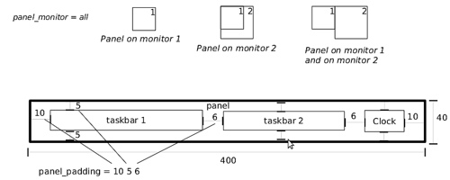
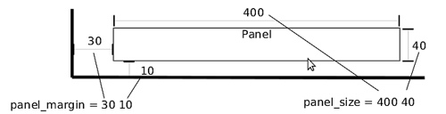
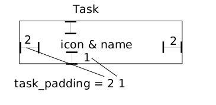

# TINT2 1 "2017-06-11" 0.14.6

## NAME
tint2 - lightweight panel/taskbar

## DESCRIPTION
tint2 is a simple panel/taskbar made for modern X window managers.
It was specifically made for Openbox but it should also work with other window managers (GNOME, KDE, XFCE etc.).

Features:

  * Panel with taskbar, system tray, clock and launcher icons;
  * Easy to customize: color/transparency on fonts, icons, borders and backgrounds;
  * Pager like capability: move tasks between workspaces (virtual desktops), switch between workspaces;
  * Multi-monitor capability: create one panel per monitor, showing only the tasks from the current monitor;
  * Customizable mouse events.

Goals:

  * Be unintrusive and light (in terms of memory, CPU and aesthetic);
  * Follow the freedesktop.org specifications;
  * Make certain workflows, such as multi-desktop and multi-monitor, easy to use.

## SYNOPSIS
`tint2 [OPTION...]`

## OPTIONS
`-c path_to_config_file`
  Specifies which configuration file to use instead of the default.

`-v, --version`
  Prints version information and exits.

`-h, --help`
  Display this help and exits.


## CONFIGURATION

### Table of contents

  * [Introduction](#introduction)

  * [Backgrounds and borders](#backgrounds-and-borders)

  * [Gradients](#gradients)

  * [Panel](#panel)

  * [Launcher](#launcher)

  * [Taskbar/Pager](#taskbar-pager)

  * [Taskbar buttons](#taskbar-buttons)

  * [Mouse actions for taskbar buttons](#mouse-actions-for-taskbar-buttons)

  * [System tray](#system-tray)

  * [Clock](#clock)

  * [Tooltip](#tooltip)

  * [Battery](#battery)

  * [Executor](#executor)

  * [Button](#button)

  * [Separator](#separator)

  * [Example configuration](#example-configuration)

### Introduction

These are instructions for configuring tint2 directly by editing its config file.
You may also use instead the graphical interface `tint2conf`.

The first time you run tint2, it will create the config file in `$HOME/.config/tint2/tint2rc` (This applies if you have done a clean install. Running tint2 in the source directory without doing 'make install' will not create the config file.)

You can also specify another file on the command line with the -c option, e.g.: `tint2 -c $HOME/tint2.conf`. This can be used to run multiple instances of tint2 that use different settings.

If you change the config file while tint2 is running, the command `killall -SIGUSR1 tint2` will force tint2 to reload it.

All the configuration options supported in the config file are listed below.
Try to respect as much as possible the order of the options as given below.

### Backgrounds and borders

The tint2 config file starts with the options defining background elements with borders:

  * `rounded = number_of_pixels` : the corner radius

  * `border_width = integer` : the border width in pixels

  * `border_sides = LRTB` : the sides to draw the border on (left, right, top, bottom). If not specified, all sides are used. *(since 0.12.12)*

  * `background_color = color opacity`
    * `color` is specified in hex RGB, e.g. #ff0000 is red
    * `opacity` varies from (0 to 100), where 0 is fully transparent, 100 is fully opaque. Note that for a transparent panel you need to enable a desktop compositor (such as compton or compiz).

  * `border_color = color opacity`
    * `color` is specified in hex RGB, e.g. #ff0000 is red
    * `opacity` varies from (0 to 100), where 0 is fully transparent, 100 is fully opaque

  * `background_color_hover = color opacity` (default: same as `background_color`) *(since 0.12.3)*
    * `color` is specified in hex RGB, e.g. #ff0000 is red
    * `opacity` varies from (0 to 100), where 0 is fully transparent, 100 is fully opaque. Note that for a transparent panel you need to enable a desktop compositor (such as compton or compiz)

  * `border_color_hover = color opacity` (default: same as `border_color`) *(since 0.12.3)*
    * `color` is specified in hex RGB, e.g. #ff0000 is red
    * `opacity` varies from (0 to 100), where 0 is fully transparent, 100 is fully opaque

  * `background_color_pressed = color opacity` (default: same as `background_color_hover`) *(since 0.12.3)*
    * `color` is specified in hex RGB, e.g. #ff0000 is red
    * `opacity` varies from (0 to 100), where 0 is fully transparent, 100 is fully opaque. Note that for a transparent panel you need to enable a desktop compositor (such as compton or compiz)

  * `border_color_pressed = color opacity` (default: same as `border_color_hover`) *(since 0.12.3)*
    * `color` is specified in hex RGB, e.g. #ff0000 is red
    * `opacity` varies from (0 to 100), where 0 is fully transparent, 100 is fully opaque

You can define as many backgrounds as you want. For example, the following config defines two backgrounds:

```
rounded = 1
border_width = 0
background_color = #282828 100
border_color = #000000 0

rounded = 1
border_width = 0
background_color = #f6b655 90
border_color = #cccccc 40
```

tint2 automatically identifies each background with a number starting from 1 (1, 2, ...).
Afterwards, you can apply a background to objects (panel, taskbar, task, clock, systray) using the background id, for example:

```
panel_background_id = 1
taskbar_background_id = 0
task_background_id = 0
task_active_background_id = 2
systray_background_id = 0
clock_background_id = 0
```

Identifier 0 refers to a special background which is fully transparent, identifier 1 applies the first background defined in the config file etc.

### Gradients

(Available since 0.13.0)

Backgrounds also allow specifying gradient layers
that are drawn on top of the solid color background.

First the user must define one or more gradients in the config file,
each starting with `gradient = TYPE`. These must be added before backgrounds.

Then gradients can be added by index to backgrounds,
using the `gradient_id = INDEX`, `gradient_id_hover = INDEX` and
`gradient_id_pressed = INDEX`, where `INDEX` is
the gradient index, starting from 1.

#### Gradient types

Gradients vary the color between fixed control points:
* vertical gradients: top-to-bottom;
* horizontal gradients: left-to-right;
* radial gradients: center-to-corners.

The user must specify the start and end colors, and can optionally add extra color stops in between
using the `color_stop` option, as explained below.

##### Vertical gradient, with color varying from the top edge to the bottom edge, two colors

```
gradient = vertical
start_color = #rrggbb opacity
end_color = #rrggbb opacity
```

##### Horizontal gradient, with color varying from the left edge to the right edge, two colors

```
gradient = horizontal
start_color = #rrggbb opacity
end_color = #rrggbb opacity
```

##### Radial gradient, with color varying from the center to the corner, two colors:

```
gradient = radial
start_color = #rrggbb opacity
end_color = #rrggbb opacity
```

##### Adding extra color stops (0% and 100% remain fixed, more colors at x% between the start and end control points)

```
color_stop = percentage #rrggbb opacity
```

#### Gradient examples

```
# Gradient 1: thin film effect
gradient = horizontal
start_color = #111122 30
end_color = #112211 30
color_stop = 60 #221111 30

# Gradient 2: radial glow
gradient = radial
start_color = #ffffff 20
end_color = #ffffff 0

# Gradient 3: elegant black
gradient = vertical
start_color = #444444 100
end_color = #222222 100

# Gradient 4: elegant black
gradient = horizontal
start_color = #111111 100
end_color = #222222 100

# Background 1: Active desktop name
rounded = 2
border_width = 1
border_sides = TBLR
background_color = #555555 10
border_color = #ffffff 60
background_color_hover = #555555 10
border_color_hover = #ffffff 60
background_color_pressed = #555555 10
border_color_pressed = #ffffff 60
gradient_id = 3
gradient_id_hover = 4
gradient_id_pressed = 2

[...]
```

### Panel

  * `panel_items = LTSBC` defines the items tint2 will show and the order of those items. Each letter refers to an item, defined as:
    * `L` shows the Launcher
    * `T` shows the Taskbar
    * `S` shows the Systray (also called notification area)
    * `B` shows the Battery status
    * `C` shows the Clock
    * `F` adds an extensible spacer (freespace). You can specify more than one. Has no effect if `T` is also present. *(since 0.12)*
    * `E` adds an executor plugin. You can specify more than one. *(since 0.12.4)*
    * `P` adds a push button. You can specify more than one. *(since 0.14)*
    * `:` adds a separator. You can specify more than one. *(since 0.13.0)*

    For example, `panel_items = STC` will show the systray, the taskbar and the clock (from left to right).

  * `panel_monitor = monitor (all or 1 or 2 or ...)` : Which monitor tint2 draws the panel on
    * The first monitor is `1`
    * Use `panel_monitor = all` to get a separate panel per monitor

  * `primary_monitor_first = boolean (0 or 1)` : Place the primary monitor before all the other monitors in the list. *(since 0.12.4)*



  * `panel_position = vertical_position horizontal_position orientation`
    * `vertical_position` is one of: `bottom`, `top`, `center`
    * `horizontal_position` is one of: `left`, `right`, `center`
    * `orientation` is one of: `horizontal`, `vertical`

  * `panel_size = width height`
    * `width` and `height` can be specified without units (e.g. `123`) as pixels, or followed by `%` as percentages of the monitor size (e.g. `50%`). Use `100%` for full monitor width/height.
      Example:

```
# The panel's width is 94% the size of the monitor, the height is 30 pixels:
panel_size = 94% 30
```

  * `panel_shrink = boolean (0 or 1)` : If set to 1, the panel will shrink to a compact size dynamically. *(since 0.13)*

  * `panel_margin = horizontal_margin vertical_margin` : The margins define the distance between the panel and the horizontal/vertical monitor edge. Use `0` to obtain a panel with the same size as the edge of the monitor (no margin).



  * `panel_padding = horizontal_padding vertical_padding spacing` : Please refer to the image below.


  * `font_shadow = boolean (0 or 1)`

  * `panel_background_id = integer` : Which background to use for the panel.

  * `wm_menu = boolean (0 or 1)` : Defines if tint2 forwards unhandled mouse events to your window manager. Useful for window managers such as openbox, which display the start menu if you right click on the desktop.

  * `panel_dock = boolean (0 or 1)` : Defines if tint2 is placed into the window manager's dock. For the openbox window manager it is advised to also use a modifier for the moveButton option, otherwise the mouse click is not forwarded to tint2 (in ~/.config/openbox/rc.xml).

  * `panel_layer = bottom/normal/top` : Places tint2 into the bottom/normal/top layer. This is helpful for specifying if the panel can be covered by other windows or not. The default is the bottom layer, but with real transparency normal or top layer may be a nice alternative.

  * `strut_policy = follow_size/minimum/none` : STRUTs are used by the window manager to decide the size of maximized windows. Note: on multi-monitor (Xinerama) setups, the panel must be placed at the edge (not in the middle) of the virtual screen for this to work correctly.
    * `follow_size` means that the maximized windows always resize to have a common edge with tint2.
    * `minimum` means that the maximized windows always expand to have a common edge with the hidden panel. This is useful if the `autohide` option is enabled.
    * `none` means that the maximized windows use the full screen size.

  * `panel_window_name = string` : Defines the name of the panel's window. Default: 'tint2'. *(since 0.12)*

  * `disable_transparency = boolean (0 or 1)` : Whether to disable transparency instead of detecting if it is supported. Useful on broken graphics stacks. *(since 0.12)*

  * `mouse_effects = boolean (0 or 1)` : Whether to enable mouse hover effects for clickable items. *(since 0.12.3)*

  * `mouse_hover_icon_asb = alpha (0 to 100) saturation (-100 to 100) brightness (-100 to 100)` : Adjusts the icon color and transparency on mouse hover (works only when mouse_effects = 1).` *(since 0.12.3)*

  * `mouse_pressed_icon_asb = alpha (0 to 100) saturation (-100 to 100) brightness (-100 to 100)` : Adjusts the icon color and transparency on mouse press (works only when mouse_effects = 1).` *(since 0.12.3)*

  * `autohide = boolean (0 or 1)` : Whether to enable panel hiding when the mouse cursor exists the panel.

  * `autohide_show_timeout = float` : Show timeout in seconds after the mouse cursor enters the panel. Use '.' as decimal separator.

  * `autohide_hide_timeout = float` : Hide timeout in seconds after the mouse cursor exits the panel. Use '.' as decimal separator.

  * `autohide_height = integer` : panel height (width for vertical panels) in hidden mode.

### Launcher
  * `launcher_item_app = path_to_application` : Each `launcher_item_app` must be a file path to a .desktop file following the freedesktop.org [specification](http://standards.freedesktop.org/desktop-entry-spec/desktop-entry-spec-latest.html). The paths may begin with `~`, which is expanded to the path of the user's home directory. If only a file name is specified, the file is search in the standard application directories (`$XDG_DATA_HOME/applications`, `~/.local/share/applications`, `$XDG_DATA_DIRS/applications`, `/usr/local/share/applications`, `/usr/share/applications`, `/opt/share/applications`).

  * `launcher_apps_dir = path_to_directory` : Specifies a path to a directory from which the launcher is loading all .desktop files (all subdirectories are explored recursively). Can be used multiple times. The path may begin with `~`, which is expanded to the path of the user's home directory. *(since 0.12)*

  * `launcher_background_id = integer` : Defines which background to use.

  * `launcher_icon_background_id = integer` : Defines which background to use for icons.

  * `launcher_padding = horizontal_padding vertical_padding spacing`

  * `launcher_icon_size = integer` : The launcher icon size, in pixels.

  * `launcher_icon_theme = name_of_theme` : (Optional) Uses the specified icon theme to display shortcut icons. Note that tint2 will detect and use the icon theme of your desktop if you have an XSETTINGS manager running (which you probably do), unless `launcher_icon_theme_override = 1`.

  * `launcher_icon_theme_override = boolean (0 or 1)` : Whether `launcher_icon_theme` overrides the value obtained from the XSETTINGS manager. *(since 0.12)*

  * `launcher_icon_asb = alpha (0 to 100) saturation (-100 to 100) brightness (-100 to 100)` : Adjusts the icon color and transparency.

  * `launcher_tooltip = boolean (0 or 1)` : Whether to show tooltips for the launcher icons.

  * `startup_notifications = boolean (0 or 1)` : Whether to show startup notifications when starting applications from the launcher. *(since 0.12)*

### Taskbar / Pager

  * `taskbar_mode = single_desktop/multi_desktop`
    * `single_desktop` : Shows a normal taskbar listing the tasks running on the current virtual desktop (also known as 'workspace');
    * `multi_desktop` : Pager like capability. Shows multiple taskbars, one per virtual desktop, with which:
      * You can drag-and-drop tasks between virtual desktops;
      * You can switch between virtual desktops.

  * `taskbar_hide_if_empty = boolean (0 or 1)` : If enabled, in multi-desktop mode the taskbars corresponding to empty desktops different from the current desktop are hidden. *(since 0.13)*

  * `taskbar_distribute_size = boolean (0 or 1)` : If enabled, in multi-desktop mode distributes between taskbars the available size proportionally to the number of tasks. Default: disabled. *(since 0.12)*

  * `taskbar_padding = horizontal_padding vertical_padding spacing`


  * `taskbar_background_id = integer` : Which background to use

  * `taskbar_active_background_id = integer` : Which background to use for the taskbar of the current virtual desktop.

  * `taskbar_hide_inactive_tasks = boolean (0 or 1)` :  If enabled, the taskbar shows only the active task. *(since 0.12)*

  * `taskbar_hide_different_monitor = boolean (0 or 1)` :  If enabled, the taskbar shows only the tasks from the current monitor. Useful when running different tint2 instances on different monitors, each one having its own config. *(since 0.12)*

  * `taskbar_always_show_all_desktop_tasks = boolean (0 or 1)` :  Has effect only if `taskbar_mode = multi_desktop`. If enabled, tasks that appear on all desktops are shown on all taskbars. Otherwise, they are shown only on the taskbar of the current desktop. *(since 0.12.4)*

  * `taskbar_sort_order = none/title/center` : Specifies the sort order of the tasks on the taskbar.  *(since 0.12)*
    * `none` : No sorting. New tasks are simply appended at the end of the taskbar when they appear.
    * `title` : Sorts the tasks by title.
    * `center` : Sorts the tasks by their window centers.
    * `mru` : Shows the most recently used tasks first. *(since 0.12.4)*
    * `lru` : Shows the most recently used tasks last. *(since 0.12.4)*

  * `task_align = left/center/right` : Specifies the alignment of the tasks on the taskbar. Default: left.

  * `taskbar_name = boolean (0 or 1)` :  Whether to show the virtual desktop name in the taskbar.

  * `taskbar_name_padding = padding` :  Padding for the virtual desktop name.

  * `taskbar_name_background_id = integer` :  Which background to use for the desktop name.

  * `taskbar_name_font = [FAMILY-LIST] [STYLE-OPTIONS] [SIZE]` :  Font configuration for the desktop name.

  * `taskbar_name_font_color = color opacity (0 to 100)` :  Font color for the desktop name.

  * `taskbar_name_active_background_id = integer` :  Which background to use for the name of the current desktop.

  * `taskbar_name_active_font_color = color opacity (0 to 100)` :  Font color for the name of the current desktop.

# Taskbar buttons

The following options configure the task buttons in the taskbar:

  * `task_icon = boolean (0 or 1)` : Whether to display the task icon. There is no explicit option to control the task icon size; it depends on the vertical padding set with `task_padding`.

  * `task_text = boolean (0 or 1)` : Whether to display the task text.

  * `task_centered = boolean (0 or 1)` : Whether the task text is centered.

  * `task_tooltip = boolean (0 or 1)` : Whether to show tooltips for tasks.

  * `task_maximum_size = width height`
    * `width` is used with horizontal panels to limit the size of the tasks. Use `width = 0` to get full taskbar width.
    * `height` is used with vertical panels.

  * `task_padding = horizontal_padding vertical_padding spacing`

  * `urgent_nb_of_blink = integer` : Number of blinks on 'get attention' events.



  * `task_font = [FAMILY-LIST] [STYLE-OPTIONS] [SIZE]`

  * `task_font_color = color opacity (0 to 100)`

  * `task_icon_asb = alpha (0 to 100) saturation (-100 to 100) brightness (-100 to 100)` : Adjust the task icon's color and transparency.

  * `task_background_id = integer` : Which background to use for non selected tasks

For the next 3 options STATUS can be `active` / `iconified`  / `urgent`:
  * `task_STATUS_font_color = color opacity (0 to 100)`

  * `task_STATUS_icon_asb = alpha (0 to 100) saturation (-100 to 100) brightness (-100 to 100)` : Adjusts the task icon's color and transparency.

  * `task_STATUS_background_id = integer` : Which background to use for the task.

### Mouse actions for taskbar buttons

The possible mouse events are: `left, middle, right, scroll_up, scroll_down`.

The possible mouse actions are: `none, close, toggle, iconify, shade, toggle_iconify, maximize_restore, desktop_left, desktop_right, next_task, prev_task`.

Use `mouse_event = action` to customize mouse actions. Example:
```
  mouse_middle = none
  mouse_right = close
  mouse_scroll_up = toggle
  mouse_scroll_down = iconify
```

The action semantics:
  * `none` : If `wm_menu = 1` is set, the mouse event is forwarded to the window manager. Otherwise it is ignored.
  * `close` : close the task
  * `toggle` : toggle the task
  * `iconify` : iconify (minimize) the task
  * `toggle_iconify` : toggle or iconify the task
  * `maximize_restore` : maximized or minimized the task
  * `shade` : shades (collapses) the task
  * `desktop_left` : send the task to the desktop on the left
  * `desktop_right` : send the task to the desktop on the right
  * `next_task` : send the focus to next task
  * `prev_task` : send the focus to previous task

### System Tray

  * `systray_padding = horizontal_padding vertical_padding spacing`

  * `systray_background_id = integer` : Which background to use.

  * `systray_sort = ascending/descending/left2right/right2left` : Specifies the sorting order for the icons in the systray: in ascending/descending alphabetical order of the icon title, or always add icons to the right/left (note that with `left2right` or `right2left` the order can be different on panel restart).

  * `systray_icon_size = max_icon_size` : Set the maximum system tray icon size to `number`. Set to `0` for automatic icon sizing.

  * `systray_icon_asb = alpha (0 to 100) saturation (-100 to 100) brightness (-100 to 100)` : Adjust the systray icons color and transparency.

  * `systray_monitor = integer (1, 2, ...)` :  On which monitor to draw the systray. The first monitor is `1`. *(since 0.12)*

  * `systray_name_filter = string` :  Regular expression to identify icon names to be hidden. For example, `^audacious$` will hide icons with the exact name `audacious`, while `aud` will hide any icons having `aud` in the name. *(since 0.13.1)*

### Clock

  * `time1_format = %H:%M` : The format used by the first line of the clock.
    * `time1_format`, `time2_format` and `clock_tooltip` use the 'strftime' syntax. More info can be found here: http://www.manpagez.com/man/3/strftime/
    * To hide the clock, comment `time1_format` and `time2_format`.

  * `time1_timezone = :US/Hawaii`
    * `time1_timezone`, `time2_timezone` and `clock_tooltip_timezone` can be used to specify a timezone. If you do not specify a value the system-wide timezone is used. The timezones can usually be found in `/usr/share/zoneinfo`. If your timezones are in a different directory, you need to specify the absolute path, e.g. `time1_timezone = :/different/zoneinfo/dir/US/Hawaii` Always prepend the timezone with a ':'

  * `time1_font = [FAMILY-LIST] [STYLE-OPTIONS] [SIZE]`

  * `time2_format = %A %d %B`

  * `time2_timezone = :Europe/Berlin`

  * `time2_font = [FAMILY-LIST] [STYLE-OPTIONS] [SIZE]`

  * `clock_font_color = color opacity (0 to 100)`

  * `clock_padding = horizontal_padding vertical_padding`

  * `clock_background_id = integer` : Which background to use

  * `clock_tooltip = %a, %d. %b %Y` : Format for the clock's tooltip.

  * `clock_tooltip_timezone = :UTC`

  * `clock_lclick_command = text` : Command to execute on left click.

  * `clock_rclick_command = text` : Command to execute on right click.

  * `clock_mclick_command = text` : Command to execute on middle click. *(since 0.12.1)*

  * `clock_uwheel_command = text` : Command to execute on wheel scroll up. *(since 0.12.1)*

  * `clock_dwheel_command = text` : Command to execute on wheel scroll down. *(since 0.12.1)*

### Tooltip

  * `tooltip_padding = horizontal_padding vertical_padding`

  * `tooltip_show_timeout = float` : Delay to show the tooltip in seconds. Use `.` as decimal separator.

  * `tooltip_hide_timeout = float` : Delay to hide the tooltip in seconds. Use `.` as decimal separator.

  * `tooltip_background_id = integer` : Which background to use for tooltips. Note that with fake transparency the alpha channel and corner radius options are not respected.

  * `tooltip_font_color = color opacity  (0 to 100)`

  * `tooltip_font = [FAMILY-LIST] [STYLE-OPTIONS] [SIZE]`

### Battery

  * `battery_hide = never/integer (0 to 100)` : At what battery percentage the battery item is hidden.

  * `battery_low_status = integer`: At what battery percentage the low command is executed.

  * `battery_low_cmd = notify-send "battery low"` : Command to execute when the battery is low.

  * `bat1_font = [FAMILY-LIST] [STYLE-OPTIONS] [SIZE]`

  * `bat2_font = [FAMILY-LIST] [STYLE-OPTIONS] [SIZE]`

  * `battery_font_color = color opacity (0 to 100)`

  * `battery_padding = horizontal_padding vertical_padding`

  * `battery_background_id = integer` : Which background to use for the battery.

  * `battery_tooltip_enabled = boolean (0 or 1)` : Enable/disable battery tooltips. *(since 0.12.3)*

  * `battery_lclick_command = text` : Command to execute on left click. *(since 0.12.1)*

  * `battery_rclick_command = text` : Command to execute on right click. *(since 0.12.1)*

  * `battery_mclick_command = text` : Command to execute on middle click. *(since 0.12.1)*

  * `battery_uwheel_command = text` : Command to execute on wheel scroll up. *(since 0.12.1)*

  * `battery_dwheel_command = text` : Command to execute on wheel scroll down. *(since 0.12.1)*

  * `ac_connected_cmd = text` : Command to execute when the power adapter is plugged in. *(since 0.12.3)*

  * `ac_disconnected_cmd = text` : Command to execute when the power adapter is unplugged. *(since 0.12.3)*

### Executor

  * `execp = new` : Begins the configuration of a new executor plugin. Multiple such plugins are supported; just use multiple `E`s in `panel_items`. *(since 0.12.4)*

  * `execp_command = text` : Command to execute. *(since 0.12.4)*

  * `execp_interval = integer` : The command is executed again after `execp_interval` seconds from the moment it exits. If zero, the command is executed only once. *(since 0.12.4)*

  * `execp_continuous = integer` : If non-zero, the last `execp_continuous` lines from the output of the command are displayed, every `execp_continuous` lines; this is useful for showing the output of commands that run indefinitely, such as `ping 127.0.0.1`. If zero, the output of the command is displayed after it finishes executing. *(since 0.12.4)*

  * `execp_has_icon = boolean (0 or 1)` : If `execp_has_icon = 1`, the first line printed by the command is interpreted as a path to an image file. *(since 0.12.4)*

  * `execp_cache_icon = boolean (0 or 1)` : If `execp_cache_icon = 0`, the image is reloaded each time the command is executed (useful if the image file is changed on disk by the program executed by `execp_command`). *(since 0.12.4)*

  * `execp_icon_w = integer` : You can use `execp_icon_w` and `execp_icon_h` to resize the image. If one of them is zero/missing, the image is rescaled proportionally. If both of them are zero/missing, the image is not rescaled. *(since 0.12.4)*

  * `execp_icon_h = integer` : See `execp_icon_w`. *(since 0.12.4)*

  * `execp_tooltip = text` : The tooltip. Leave it empty to not display a tooltip. Not specifying this option leads to showing an automatically generated tooltip with information about when the command was last executed. *(since 0.12.4)*

  * `execp_font = [FAMILY-LIST] [STYLE-OPTIONS] [SIZE]` : The font used to draw the text.  *(since 0.12.4)*

  * `execp_font_color = color opacity` : The font color. *(since 0.12.4)*

  * `execp_markup = boolean (0 or 1)` : If non-zero, the output of the command is treated as Pango markup, which allows rich text formatting. The format is [documented here](https://developer.gnome.org/pygtk/stable/pango-markup-language.html). Note that using this with commands that print data downloaded from the Internet is a possible security risk. *(since 0.12.4)*

  * `execp_background_id = integer` : Which background to use. *(since 0.12.4)*

  * `execp_centered = boolean (0 or 1)` : Whether to center the text. *(since 0.12.4)*

  * `execp_padding = horizontal_padding vertical_padding spacing_between_icon_and_text` *(since 0.12.4)*

  * `execp_lclick_command = text` : Command to execute on left click. If not defined, `execp_command` is  executed immediately, unless it is currently running. *(since 0.12.4)*
  * `execp_mclick_command = text` : Command to execute on right click. If not defined, `execp_command` is  executed immediately, unless it is currently running. *(since 0.12.4)*
  * `execp_rclick_command = text` : Command to execute on middle click. If not defined, `execp_command` is  executed immediately, unless it is currently running. *(since 0.12.4)*
  * `execp_uwheel_command = text` : Command to execute on wheel scroll up. If not defined, `execp_command` is  executed immediately, unless it is currently running. *(since 0.12.4)*
  * `execp_dwheel_command = text` : Command to execute on wheel scroll down. If not defined, `execp_command` is  executed immediately, unless it is currently running. *(since 0.12.4)*

#### Executor samples

##### Print the hostname

```
execp = new
execp_command = hostname
execp_interval = 0
```

##### Print disk usage for the root partition every 10 seconds

```
execp = new
execp_command = df -h | awk '/\/$/ { print $6 ": " $2 " " $5}'
execp_interval = 10
```

##### Button with icon and rich text, executes command when clicked

```
execp = new
execp_command = echo /usr/share/icons/elementary-xfce/emblems/24/emblem-colors-blue.png; echo '<span foreground="#7f7">Click</span> <span foreground="#77f">me</span> <span foreground="#f77">pls</span>'
execp_has_icon = 1
execp_interval = 0
execp_centered = 1
execp_font = sans 9
execp_markup = 1
execp_font_color = #aaffaa 100
execp_padding = 2 0
execp_tooltip = I will tell you a secret...
execp_lclick_command = zenity --info "--text=$(uname -sr)"
execp_background_id = 2
```

##### Desktop pager with text

```
execp = new
execp_command = xprop -root -spy | awk '/^_NET_CURRENT_DESKTOP/ { print "Workspace " ($3 + 1) ; fflush(); }'
execp_interval = 1
execp_continuous = 1
```

##### Desktop pager with icon

```
execp_command = xprop -root -spy | awk -v home="$HOME" '/^_NET_CURRENT_DESKTOP/ { print home "/.config/myPager/" ($3 + 1) ".png\n" ; fflush(); }'
execp_interval = 1
execp_has_icon = 1
execp_cache_icon = 1
execp_continuous = 2
```

##### Round-trip time to the gateway, refreshed every second

```
execp = new
execp_command = ping -i 1 -c 1 -W 1 -O -D -n $(ip route | grep default | grep via | grep -o '[0-9]*\.[0-9]*\.[0-9]*\.[0-9]*') | awk '/no/ { print "<span foreground=\"#faa\">timeout</span>"; fflush(); }; /time=/ { gsub(/time=/, "", $8); printf "<span foreground=\"#7af\">%3.0f %s</span>\n", $8, $9; fflush(); } '
execp_continuous = 0
execp_interval = 1
execp_markup = 1
```

##### Memory usage

```
execp = new
execp_command = free | awk '/^-/ { printf "Mem: '$(free -h | awk '/^Mem:/ { print $2 }')' %.0f%%\n", 100*$3/($3+$4); fflush(stdout) }'
execp_interval = 5
execp_continuous = 0
```

##### Network load

```
# Note the use of "stdbuf -oL" to force the program to flush the output line by line.
execp = new
execp_command = stdbuf -oL bwm-ng -o csv -t 1000 | awk -F ';' '/total/ { printf "Net: %.0f Mb/s\n", ($5*8/1.0e6) }; fflush(stdout)'
execp_continuous = 1
execp_interval = 1
```

### Button

  * `button = new` : Begins the configuration of a new button. Multiple such plugins are supported; just use multiple `P`s in `panel_items`. *(since 0.14)*

  * `button_icon = text` : Name or path of icon (or empty). *(since 0.14)*

  * `button_text = text` : Text to display (or empty). *(since 0.14)*

  * `button_tooltip = text` : The tooltip (or empty). *(since 0.14)*

  * `button_font = [FAMILY-LIST] [STYLE-OPTIONS] [SIZE]` : The font used to draw the text.  *(since 0.14)*

  * `button_font_color = color opacity` : The font color. *(since 0.14)*

  * `button_background_id = integer` : Which background to use. *(since 0.14)*

  * `button_centered = boolean (0 or 1)` : Whether to center the text. *(since 0.14)*

  * `button_padding = horizontal_padding vertical_padding spacing_between_icon_and_text` *(since 0.14)*
  * `button_max_icon_size = integer` : Sets a limit to the icon size. Otherwise, the icon will expand to the edges. *(since 0.14)*

  * `button_lclick_command = text` : Command to execute on left click. If not defined, `execp_command` is  executed immediately, unless it is currently running. *(since 0.14)*
  * `button_mclick_command = text` : Command to execute on right click. If not defined, `execp_command` is  executed immediately, unless it is currently running. *(since 0.14)*
  * `button_rclick_command = text` : Command to execute on middle click. If not defined, `execp_command` is  executed immediately, unless it is currently running. *(since 0.14)*
  * `button_uwheel_command = text` : Command to execute on wheel scroll up. If not defined, `execp_command` is  executed immediately, unless it is currently running. *(since 0.14)*
  * `button_dwheel_command = text` : Command to execute on wheel scroll down. If not defined, `execp_command` is  executed immediately, unless it is currently running. *(since 0.14)*

### Separator

  * `separator = new` : Begins the configuration of a new separator. Multiple such plugins are supported; just use multiple `:`s in `panel_items`. *(since 0.13.0)*

  * `separator_background_id = integer` : Which background to use. *(since 0.13.0)*

  * `separator_color = color opacity` : The foreground color. *(since 0.13.0)*

  * `separator_style = [empty | line | dots]` : The separator style. *(since 0.13.0)*

  * `separator_size = integer` : The thickness of the separator. Does not include the border and padding. For example, if the style is `line`, this is the line thickness; if the style is `dots`, this is the dot's diameter. *(since 0.13.0)*

  * `separator_padding = side_padding cap_padding` : The padding to add to the sides of the separator, in pixels. *(since 0.13.0)*

### Example configuration

See /etc/xdg/tint2/tint2rc.

## AUTHOR
tint2 was written by Thierry Lorthiois <lorthiois@bbsoft.fr>.
It is based on ttm, originally written by Pål Staurland <staura@gmail.com>.

This manual page was originally written by Daniel Moerner <dmoerner@gmail.com>, for the Debian project (but may be used by others).
It was adopted from the tint2 docs.

## SEE ALSO
The main website https://gitlab.com/o9000/tint2
and the wiki page at https://gitlab.com/o9000/tint2/wikis/home.

This documentation is also provided in HTML and Markdown format in the system's default location
for documentation files, usually `/usr/share/doc/tint2` or `/usr/local/share/doc/tint2`.
